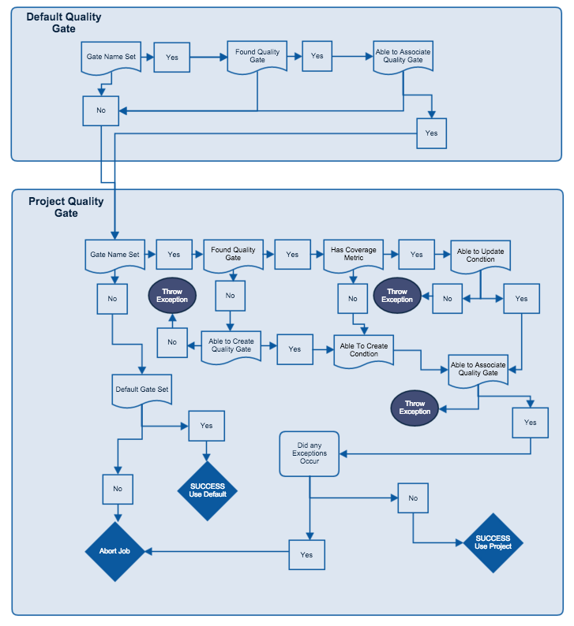
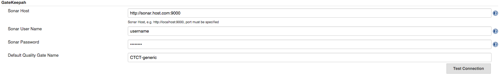
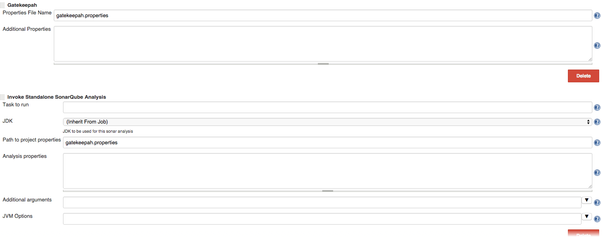
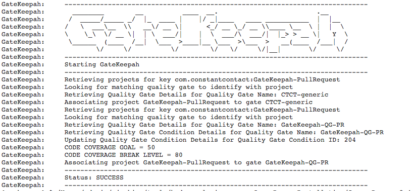

GateKeepah
======
## Summary
A plugin with a targeted purpose designed to run before sonar code analysis to create, update, and assign a quality gate for code coverage to a project.  Having the quality gate in place for your analysis will break your build if it does not meet the criteria supplied by the plugin.

### Example Use Case
Job is triggered from a pull request (see YAPah Jenkins Plugin), the project will be cloned and built with all the pull requests changes.  Gatekeeper creates a sonar project, a quality gate, and assigns the quality gate to that project then the Sonar Qube Analysis plugin will either succeed or fail the build based on the quality gate metrics.  

### Required Jenkins Plugins
This plugin does not require plugins to function.  However, you need to have a working instance of Sonar running to be able to run the plugin. 

### Required Jenkins Plugins
* SonarQube Plugin (v2.3)

### Jenkins Installation
1. Build the plugin (mvn package)
2. Log into Jenkins
3. Click Manage Jenkins
4. Click Manage Plugins
5. Click Advanced Tab
6. Under upload plugin, select the HPI file from the target directory and select upload

### Build the plugin (mvn package)
1. Build the plugin (mvn package)
2. Copy GateKeepah.hpi from your target directory into your plugins directory. (Note: One way to find your plugins directory on mac or linux is to run the ps shell command as in _ps -ef | grep Jenkins_)
3. Restart Jenkins

### Global Configuration
1. Go to Manage Jenkins
2. Configure System
3. GateKeepah
4. Fill out Sonar Host, Sonar User Name, Sonar Password, and optionally fill out the Default Quality Gate Name
5. Test Connection (even if your password and username are wrong, this may work because of security settings in sonar, make sure to use a sonar-administrator account)

### Build Configuration
1. Add GateKeepah as a build step
2. Enter the properties file or supply the properties in the additional properties field
3. Save changes

### Flow Diagram


### Example Global Configuration


### Example Configuration


### Example Console Output


### Running Java Tests locally
Since some of the tests require an instance of sonar to hit all code paths you need to supply the authentication criteria and host when running the tests.  There is also a config.properties file that needs to have seeded data.  
```
mvn clean package -Dusername=username -Dpassword=password -Dhost=http://sonar.host.com:9000
```
